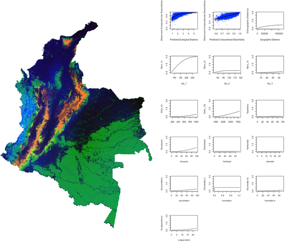

## Sobre la herramienta

*Chapman* es una aplicación que permite la identificación iterativa  de los sitios que mayor probabilidad tienen de complementar el muestreo existente en un área determinada. Esta aplicación fue nombrada en honor a [Frank Chapman](https://en.wikipedia.org/wiki/Frank_Chapman_(ornithologist) (1864-1945), ornitólogo del Museo Americano de Historia Natural quien dirigió la realización de una serie de expediciones biológicas en Colombia con el propósito de muestrear representativamente las aves de las zonas de vida del país. Los esfuerzos de F. Chapman y su equipo en Colombia culminaron en la publicación del clásico *The distribution of Bird-Life in Colombia* (Chapman 1917). 

*Chapman* está basada en el modelamiento generalizado de disimilitud (GDM por sus siglas en inglés), una técnica estadística para analizar y predecir patrones espaciales de recambio en la composición de comunidades (Ferrier *et al*. 2007).  En el GDM inicialmente se relaciona estadísticamente una matriz de similitud composicional entre sitios muestreados con una matriz de las diferencias en variables ambientales entre los mismos sitios para modelar como cambia la composición de especies en distintos gradientes ambientales. A partir de este modelamiento es posible predecir el grado de similitud entre sitios muestreados y sitios no muestreados, para hallar entre todos los sitios posibles en un área de interés el sitio más disímil, que es igualmente el más complementario al muestreo existente. Dado que al incluir un nuevo sitio en la lista de sitios muestreados la disimilitud de los sitios no muestreados cambia, es necesario hacer una nueva iteración de GDM en la medida que sitios son añadidos al muestreo para encontrar el siguiente sitio más complementario.

Esta implementación de *Chapman* esta inicialmente dirigida a generar recomendaciones para el muestreo a ser realizado en el marco del Global Big Day del 2018. Para esto se escogieron los listados de eBird generados a partir entre el 2012 y 2017 (Cornell Lab of Ornithology 2017) de tipo transecto o estacionario; en el caso de transectos se usaron solo aquellos con una longitud menor a 5km. Se incluyeron únicamente las observaciones en las que todas las especies fueron reportadas. Esto en un esfuerzo de seleccionar únicamente los listados que pudieran considerarse como “bien muestreados” y relativamente homogéneos espacialmente. Cada listado fue asociado a un “sitio”, definido como el centroide de una celda en una grilla espacial de Colombia con resolución de 5 x 5 km. A partir de estos listados se generó una matriz de similitud entre los sitios muestreados usando el índice de similitud de jaccard, ponderando los sitios por riqueza y utilizando unicamente aquellos sitios con una riqueza mayor o igual a 40. Esta matriz de disimilitud en composición fue relacionada a través del GDM con una matriz de disimilitud entre las variables ambientales entre dichos sitios. Las variables ambientales consistieron de una combinación de variables bioclimáticas provenientes de WorldClim (Hijmans et al. 2005; temperatura media anual, rango diurno medio, isotermalidad, estacionalidad de la temperatura, precipitación anual, estacionalidad de la precipitación y precipitación del trimestre más cálido) y de clases principales de vegetación derivadas de MODIS (proporción de bosque primario, bosque secundario, herbazal, arbustal, humedal continental, humedal marino, superficie de agua dulce). Para el modelamiento de disimilitud se usó el paquete gdm de R (Manion et al. 2017). Las variables empleadas explicaron la disimilitud observada en un 64.1% (Fig. 1).

**Figura 1.** Izq. Predicción de disimilitud de comunidades de aves en Colombia. Der. Respuesta de la disimilitud composicional  en gradientes ambientales.

La aplicación Chapman fue conceptualizada y desarrollada por [Jorge Velásquez-Tibatá](https://www.researchgate.net/profile/Jorge_Velasquez-Tibata) e [Iván González](https://www.researchgate.net/profile/Ivan_Gonzalez15), investigadores del Laboratorio de Biogeografía Aplicada del Programa de Evaluación y Monitoreo del Instituto Humboldt, con apoyo en IT de Daniel López y de César Gutierrez en el diseño web. Para más información contacte a jvelasquez@humboldt.org.co.

#### Referencias
1. Chapman, F. M. (1917) The distribution of bird-life in Colombia: a contribution to a biological survey of South America. Bulletin of the American Museum of Natural History, Vol. 36.

2. Cornell Lab of Ornithology (2017). eBird Basic Dataset. Version: EBD_relMay-2017. Cornell Lab of Ornithology, Ithaca, New York.

3. Ferrier, S., Manion, G., Elith, J., & Richardson, K. (2007) Using generalized dissimilarity modelling to analyse and predict patterns of beta diversity in regional biodiversity assessment. Diversity and distributions, 13(3), 252-264.

4. Manion, G., Lisk, M., Ferrier S., Nieto-Lugilde, D., Mokany, D.  & Fitzpatrick, M. C. (2017) gdm: Generalized Dissimilarity Modeling.  R package version 1.3.1. https://CRAN.R-project.org/package=gdm

5. Hijmans, R.J., S.E. Cameron, J.L. Parra, P.G. Jones and A. Jarvis (2005) Very high resolution interpolated climate surfaces for global land areas. International Journal of Climatology 25: 1965-1978.

